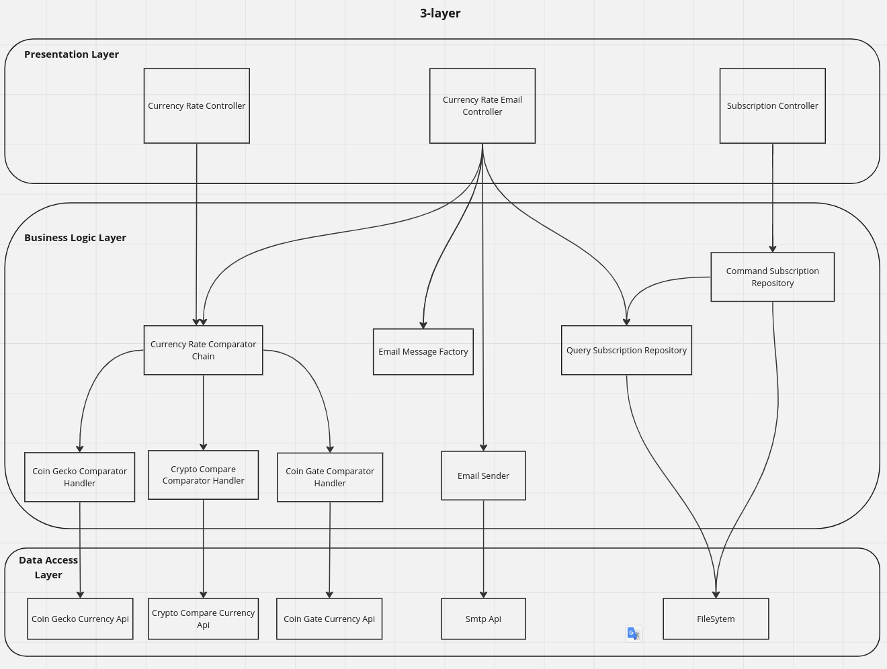

# GSES2 BTC application

This service has ability:

    - find out the current bitcoin (BTC) exchange rate in hryvnia (UAH)

    - sign an email to receive information on the exchange rate change

    - a request that will send the current rate to all subscribed users.

# Microservices
1. `currency` - currency microservice
2. `subsription` - currency microservice

# Run project locally
1. Copy `.env` to `.env.local`. You can use variables without any changes to work by default.
2. Install Docker and Docker Compose.
3. Run `docker-compose up -d`
4. Run `docker-compose exec {microservice-name}-php-fpm composer install` to install dependencies
4. `currency` will be available on http://localhost:4505 by default. Api documentation http://localhost:4505/api/doc
   `subsription` will be available on http://localhost:4507 by default. Api documentation http://localhost:4507/api/doc
The swagger documentation was updated from 2 to 3 version and adopted with `NelmioApiDocBundle`
5. Also, in project was used `schickling/mailcatcher`. It is super simple SMTP server which catches 
any message sent to it to display in a web interface. UI is available on http://localhost:32770

# API short description
1. `/api/rate` - find out the current bitcoin (BTC) exchange rate in hryvnia (UAH).
2. `/api/subscribe` - sign an email. Emails are stored in simple txt file by path `system/emails.txt`. Project will create this file if it isn't created.
3. `/api/sendEmails` - send the current rate to all subscribed users. Project read subscribed emails from `system/emails.txt` and send emails to with current rate to them

# Commands
 You can run following commands to get logs
1. Symfony messenger commands: 
- `docker-compose exec currency-php-fpm bin/console messenger:consume rabbitmq_logs` - default logs channel
- `docker-compose exec currency-php-fpm bin/console messenger:consume rabbitmq_error_logs` - error logs channel

2. Custom commands:
- `docker-compose exec currency-php-fpm bin/console messenger:consume app:get-logs`- default logs channel list
- `docker-compose exec currency-php-fpm bin/console messenger:consume app:get-error-logs`- error logs channel list

# Architecture

# Tests
1. Copy `.env.test` to `.env.test.local`. You can use variables without any changes to work by default.
2. To run tests you can use command `docker-compose exec php-fpm bin/phpunit`

# Linter
1. Run `docker-compose exec php-fpm vendor/bin/php-cs-fixer fix {folder-name} --allow-risky=yes` to run code style fixes
2. Run `docker-compose exec php-fpm vendor/bin/psalm` to run static analyze checker 